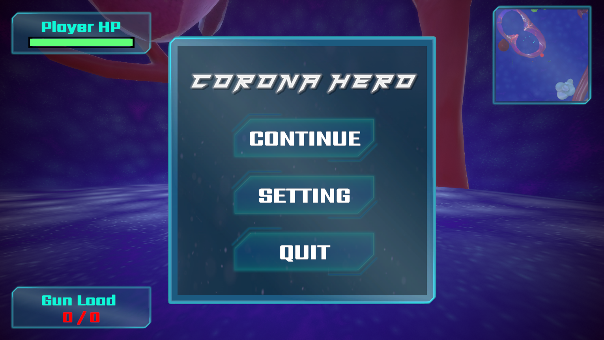
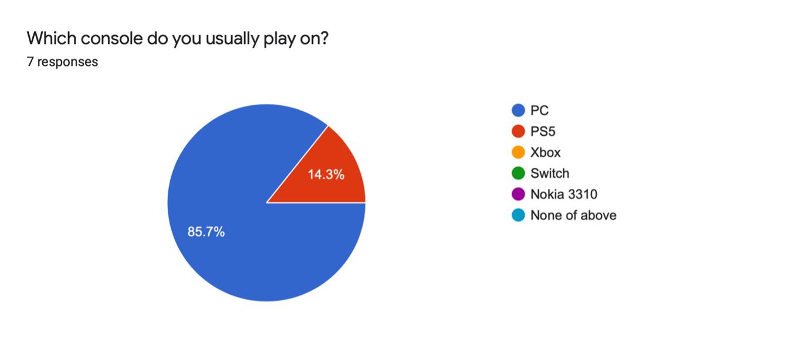

**The University of Melbourne**
**COMP30019 – Graphics and Interaction**
# *Corona Hero* - README

## Table of Contents
* [Team Members Information and Contributions](#team-members-information-and-contributions)
* [Explanation of The Game](#explanation-of-the-game)
* [How to use it?](#how-to-use-it)
* [Design of Objects and Entities](#design-of-objects-and-entities)
* [Graphics Pipeline and Camera Motion](#graphics-pipeline-and-camera-motion)
* [Procedural Generation Algorithm Used](#procedural-generation-algorithm-used)
* [Custom Shaders](#custom-shaders)
* [Particle System](#particle-system)
* [Querying and Observational Methods](#querying-and-observational-methods)
* [Evaluation](#evaluation)
* [References and External Resources](#references-and-external-resources)

## Team Members Information and Contributions
| Name | Student ID | Contributions |
|  :---:  |  :---:  |  :--- |
| Ren Zhang | 1025213 | Animation Setting, Evaluation, Enemy AI, Gameplay Demo, Scene Design, Shader, Terrain, Weapon Setup |
| Jia Hern Lee | 997562 | Audio, Evaluation, Gameplay Demo, Player Movement, Scene Design, UI Design, Weapon Setup |
| Kaiyuan Zheng | 1024904 | Evaluation, Enemy AI, Particle System, Procedural Generation, Scene Design, Terrain |
| Yun-Chi Hsiao | 1074004 | Animation Setting, Evaluation, README Report, UI Functions, Scene Design, Weapon Setup |

## Explanation of The Game
_Corona Hero_ is a first-person shooting game which is inspired by the nowadays covid-19 situation. Within a body full of virus and bacteria, you are not only going to dodge the attack from those monsters, but also eliminate them one by one. Slaying the enemies, finding a key to pass through other organs, and beating the boss down bravely as a legendary will always do. Now, pick up your favourite weapon, then start to kick the virus out of your body.<br/><br/>
*Game Demo on YouTube:* <br/>
[**Corona Hero**](https://www.youtube.com/watch?v=EKDp80TE-cg)<br/> 
[<table><tr><td></td></tr></table>](https://www.youtube.com/watch?v=EKDp80TE-cg)<br/>


### Key features:
- **Weapons Switching**: <br/>
> There are three types of weapons provided in the game which are pistol, riffle, and grenade. Each weapon causes different damage to the enemies and the shooting speed is expected to be different as well. As a fps game, _Corona Hero_ let the players to choose their favourite weapons in anytime.
- **Wall Run**:<br/>
> The players can have more advantage when they are against the wall. Even when they are surrounded by enemies and stuck at the corner, they still have a chance to find a way out.
- **Double Jump**:<br/>
> Nothing but double jump. It may save your life when you are executing gun reload.
- **Shield**:<br/>
> Oops, sorry! The shield is not for you. In _Corona Hero_, the viruses and bacterias will grow and evolve. The shield will provide addtional armor for the enemies which means they won't get any damage until the armours is destroyed.

## How to use it?
When the application is opened, you will view the Main Menu first.<br/>

**Main Menu:**<br/>
- Click `Start` to start your journey to be the Corona Hero.
- Click `Setting` to navigate to Setting Menu.
- Click `Quit` to say goodbye.
<p align="center">
  
</p>

**Pause Menu:**<br/>
- Click `Continue` to back to the game.
- Click `Setting` to navigate to Setting Menu.
- Click `Quit` to navigate to Main Menu.
<p align="center">
  
</p>

**Setting Menu:**<br/>
- Adjust game volume via slider bar.
- Click on the speaker icon to mute or unmute the audio.
- The control instruction is displayed on the top.
- Click `Back` to navigate to Main Menu or Pause Menu.
<p align="center">
  
</p>

**GameOver Menu:**<br/>
- Click `Restart` to restart the game.
- Click `Quit` to navigate to Main Menu.
<p align="center">
  
</p>

**Tutorial (In Game Tips):**<br/>
- At some checkpoints, the tips will be shown.
- Read the instruction to understand the tip.
- Click `Back` to continue the game.
<p align="center">
  
</p>

**Control:**<br/>
| Input | Action |
| :---: | :---: |
| `W` | Move Forward |
| `A` | Move Left |
| `S` | Move Backward |
| `D` | Move Right |
| `R` | Reload |
| `ESC` | Pause |
| `1` | Weapon 1 |
| `2` | Weapon 2 |
| `3` | Weapon 3 |
| `SPACE` | Jump |
| `SHIFT` | Sprint |
| `MOUSE` | View |
| `MOUSE LEFT-CLICK`| Shoot |
| `MOUSE SCROLL`| Switch Weapon |

## Design of Objects and Entities
- Character
> Since _Corona Hero_ is a fps game, the player is not going to view the character body (except the character’s forearms and hands) in anytime during the game. Therefore, the main body of the character would not be rendered at all. However, to detect the attack from the enemies, an empty object with capsule collider is included in the player object. Moreover, the cameras which are filming from the character’s perspective will always follow the character.<br/>
<p align="center">
  
</p>

- Weapon
> The weapon models including pistol, riffle, pill are all taken from the external resources Creator Kit FPS provided by *Unity Learn* (see [*more details*](#references-and-external-resources)). The particle system associated with the muzzle let the pistol and riffle looks fancier. On the other hand, we create the bullet and the scripts for controlling bullet damage, shooting speed, and gun load management. By combing all these features, the weapons can be used in a proficient way.<br/>
<p align="center">
  
</p>

- Enemy
> There are six different enemies in _Corona Hero_. The models are taken from different external resources (see [*more details*](#references-and-external-resources)). However, to let the models interacting with other entities properly, we reset the animations of each enemy. Furthermore, by adding stat script for managing attack damage, health, speed of movement, each enemy can be easily set in the scene. To implement the feature of AI, *Nav Mesh Agent* is inserted in every enemy. The component will assist the enemy to detect the surrounding objects and it help us to develop the enemy AI eventually.<br/>
<p align="center">
  
</p>

## Graphics Pipeline and Camera Motion

1. **Post Processing**<br/><br/>
  To have a better looking graphic, post-process has been used for applying filters and effects on the image of the game. We use ambient occlusion, depth of field and vignette to change the game appearing and let the graphic to fit the game theme.<br/>
<p align="center">
  
</p>

2. **Camera Setting**<br/><br/>
  There are three cameras set in the game. The first camera is applied for mini map rendering. It will always stick on the top of the player and take the image via bird’s eye view. The height of the camera can decide how big the mini map is and how clear the ground can be seen. Moreover, there are two other cameras are used for displaying main player view. One is rendering scene, and one is rendering weapon. The reason why we set two cameras is because the issue of weapon clipping. By displaying two objects (main view and weapon) separately, the weapon will not pass through the wall in any circumstance. 

## Procedural Generation Algorithm Used
| Name | File Location|
| :---: | :---:|
| MeshGenerator | _Assets/Scenes/Another Map/MeshGenerator.cs_ |

- **Diamond-square algorithm**<br/>

```c#
  public class MeshGenerator : MonoBehaviour
  {
	private Terrain terrain;
	private TerrainCollider terrainCollider;
	public float randomX = 5.0f;
	public float randomY  = 10.0f;
	public int heightMapSize = 513;
	private float[,] heightMap;
	public float roughness = 2f;

	void Start()
	{	
		DiamondSquare();
		terrain = GetComponent<Terrain>();
		terrain.terrainData.SetHeights(0, 0, heightMap);
		terrainCollider = GetComponent<TerrainCollider>();
		terrainCollider.terrainData = terrain.terrainData;

	}

      more code...
  }
```
  
  The `randomX` is the minimum of the terrain height and the `randomY` is the maximum of the terrain height. Moreover, the value of roughness represents the amount of the difference between two adjacent vertices. It means that if the roughness is higher, the terrain probably is going to be steeper. The `heightMapSize` is the size of map we want to generate.

  There are two main steps,
	1. The ***square step***: for each diamond in the array, set the midpoint of that diamond to be the average of the four corner points plus a random value.
	2. The ***diamond step***: For each square in the array, set the midpoint of that square to be the average of the four corner points plus a random value.
  ```c#
	public class MeshGenerator : MonoBehaviour
	{	
		more code...
		
		void DiamondSquare()
    	{
			heightMap = new float[heightMapSize, heightMapSize];

			// Randomize the corners
			heightMap[0,0] = Random.Range(.1f, .3f);
			heightMap[heightMapSize - 1, 0] = Random.Range(.1f, .3f);
			heightMap[0, heightMapSize - 1] = Random.Range(.1f, .3f);
			heightMap[heightMapSize - 1, heightMapSize - 1] = Random.Range(.1f, .3f);
			
			// ChunkSize is the number of tiles in one square
			int chunkSize = heightMapSize - 1;
			float average;
			int half, x, y;

			while (chunkSize > 1)
			{
				half = chunkSize / 2;

				// Square step
				for (x = 0; x < heightMapSize - 1; x+=chunkSize)
				{
					for (y = 0; y < heightMapSize - 1; y+=chunkSize)
					{
						average = heightMap[x, y]
								+ heightMap[x + chunkSize, y]
								+ heightMap[x, y + chunkSize]
								+ heightMap[x + chunkSize, y + chunkSize];
						average /= 4.0f;

						// Offset the average by a random value
						average += (Random.Range(randomX,randomY) * 2.0f * roughness) - roughness;
						heightMap[x + half, y + half] = average;
					}
				}

				// Diamond step
				for (x = 0; x < heightMapSize - 1; x+=half)
				{
					for (y = (x+half) % chunkSize; y < heightMapSize - 1; y+=chunkSize)
					{
						average = heightMap[(x - half + heightMapSize - 1) % (heightMapSize - 1), y]
								+ heightMap[(x + half) % (heightMapSize - 1), y]
								+ heightMap[x, (y + half) % (heightMapSize - 1)]
								+ heightMap[x, (y - half + heightMapSize -1) % (heightMapSize - 1)];
						average /= 4.0f;

						// Offset the average by a random number
						average += (Random.Range(randomX,randomY) * 2.0f * roughness) - roughness;
						heightMap[x, y] = average;

						if (x == 0)
						{
							heightMap[heightMapSize - 1, y] = average;
						}

						if (y == 0)
						{
							heightMap[x, heightMapSize - 1] = average;
						}
					}
				}
				
				// Expand from the center of one square
				chunkSize /= 2;
				// Make the terrain smoother
				roughness /= 2;
			}
    	}
	}
  ```

  After the computation, the terrain data of the game object will be set based on the simulated `heightMap` (2d-array).<br/>
  <p align="center">
    
  </p>
  <p align="center">
    
  </p>

## Custom Shaders
| Name | File Location|
| :---: | :---:|
| Shield | _Assets/Scenes/character/enemy/shield/shield 1.shader_ |
| Dissolve | _Assets/Scenes/character/enemy/dissolve/disolve.shader_ |

- **Shield**<br/><br/>
  Our shield shader design is referenced to the following materials (see [*more details*](#references-and-external-resources)):
  1.	Interactable ripple effect in live: https://www.bilibili.com/video/BV1Xh411D7z7 
  2.	Overwatch Shield by LEXDEV Tutorials: https://lexdev.net/tutorials/case_studies/overwatch_shield.html

  <p align="center">
    
    
    <br/> 
    The left one will be our main texture, and the right one highlights the boundary of the first texture.
    <br/>
  </p>

  First, we put our main texture to our render position. We will use `TRANSFORM_TEX`, then we will use `tex2D` to apply of texture on _uv_. Then we can easily set a basic color to apply on out texture, due to the texture only contains black and white color. We can use our output of `tex2D` then multiply with the default color. Then we can set a variable called `_PulseIntensity` to change our texture color intensity. The thing we have done will be save it in one variable called `pulseTerm`.

  Moreover, if we want to move it, we will need `_Time.y`. However, we are not only looking for `_Time.y`, if we use it directly, our color will be changed to white by time. Therefore, we want to have a range of value to modify our color. That’s why we will using _sin()_ here. If we apply _sin()_, the color will move between black and white, which is not exactly what we want. Then, we can only get the positive value of sin, so we won’t see black color anymore. Till now, our function is `pulseTerm * abs(sin(_Time.y))`. Unfortunately, it is still not moving now, instead it is just flashing. To let the shield moving, we need to know the position of its vertex so we can know where we should apply color. Hence, except the `SV_POSITION` and `TEXCOORD0`, we will need another variable to save vertex, since `SV_POSITION` is already been used to save the clip’s position. We will set `float4 vertexObjPos: TEXCOORD1`. We are going to see `vertexObjPos` to save `v.vertex` which is the vertex position. If we want to move in _x direction_, we can simply apply `i.vertexObjPos` in our sin function, as `abs(sin(_Time.y * _PulseTimeScale - (i.vertexObjPos.x))`. Using minus or positive here is just the direction of moving which will not change the result at all. 
  
  Why is it working? Let’s try only apply `i.vertexObjPos.x` in the sin function as `sin(i.vertexObjPos.x)`. then we will see a lot of strips on it. It’s like we are pointing our vertex _x position_ on our sin graph, and in different position of a sin graph will show different value between 0 and 1. Then, if we add `_Time.y` on it,  the sin graph will pushing these points to the next location. That’s why we will have a moving effect. However, the strips are too close. To sol;ve this issue, we can simply add a float variable called `_PulsePosScale` to make the width to become wider. But we don’t want it start from left, so we apply a _abs_ on `i.vertexObjPos.x`, then we can see it will moving from the center. That’s because all negative `vertex.x` become positive, so there will be half of our shape is moving in a reverse direction. 
  
  Till now, our shader is only moving a straight line. To improve it, we will make some offset on it. By adding `pulseTex.r * _PulseTexOffsetScale` as the offset, the moving will be based on the different color zone of the texture. Using `pulseTex.r`, `pulseTex.g` or `pulseTex.b` are all acceptable, since our texture is black and white. In addition, to highlight the boundary, we simply add the second texture on our shader without any other effects.

  Now, let’s move to the depth part. Before we start, we need to set our camera mode, so we can access the value we want to use.
  ```c#
  using UnityEngine;
  [ExecuteInEditMode]
 
  public class camset : MonoBehaviour
  {
      void OnEnable ()
      {
        GetComponent<Camera>().depthTextureMode = DepthTextureMode.DepthNormals;
      }
  }
  ```
  Then, we can get `smapler2D_CameraDepthNormalsTexture` in our shader. For depth calculation, we will need two things which the screen position of our clip position vertex and the calculated depth: `float4 screenPos: TEXCOORD2;` and `float depth: TEXCOORD3;`.
 
  For the screen position, we utilize a function provided by unity which is `ComputeScreenPos()` to get what we want. So now we know what is the _relatively vertex position_ in the screen position. To calculate depth, we need to calculate our _vertex world position_ to _screen position_, we simply do `mul(UNITY_MATRIX_MV, v.vertext)`.
 
  Now, the _z value_ of this is the distance of vertex from the close plane. Since the value is negative right now, we will negate it. Then, we need to time the far plane to get the right position since we have reverse it. The far plane is provided by unity, which is `_ProjectionParams.w`. Now, our depth will be `o.depth = -mul(UNITY_MATRIX_MV, v.vertex).z * _ProjectionParms.w;`.
 
  Now, let’s get the difference of the camera texture depth and our calculated depth. We do `diff = tex2D(_CameraDepthNormalsTexture, i.screenPos.xy) - i.depth;`.
 
  Since we can get the difference of camera's depth and the outer shader's depth, we know the position of intersection. Then, we need to get the perspective ratio. Basically, we adjust our screen position for the skewing of the coordinates due to the perspective camera. Then, since the depth information is stored in _zw value_ of the depth texture, it will be extracted by `DecodeFloatRG()` which can help us to decode _zw_ as a float. Unfortunately, we are still facing some problems here. When we start using these data to calculate the gradient, further plane may make our color be too white, so we will need to divide our difference with the far plane `_ProjectionParams.w`. Now, we need to filter the color that greater to 1, so we will use a min here as `min((diff) / _ProjectionParms.w, 1.0f);`

  In addition, since the value is too small, it leads the color intensity to be too small. Therefore, we need to inverse it by using 1 to minus it. Then, we will do exactly same think as before, appying a color and time with gradient and intensity value. The only difference is we will using _pow()_ to get the gradient color because it is gradient, we cannot just multiply it and a value from 0 to 1 is required. Then, we add this color value into our output, so the intersection color has been implemented perfectly.

  Now, let’s move to the “ripple part”. It’s not actually a ripple effect, We call it ripple is because this idea is come from a ripple tutorial. First, we need to know where we want to have ripple. For this, we will use c#. From the rayHit, we can get the _texcoord position_ of hitting point, so we know where we can locate it on our _uv_. Then we post it into our shader. Let’s call it `_Vector`. Then we need a place to save the _uv_ data as `float textuv: TEXCOORD4;`. Moreover, we save our `v.uv` in it. Then, like we have done before, we get the _x_ and _y_ of the _uv_, then, we can use this `(max(_Vector.z - length(uv-_Vector.xy), 0 )`. Therefore, we can know where is our the range of our setting radius (by the way, the _z value_ of `_Vector` is a radius we set in C#, and the _uv_ is `i.texuv`). Now, we need to have a simply flashing effect, since our gun shooting speed is too fast, we do not need further effect (or we can do a render texture, and modified it by c#, but that will not be shader anymore). The value we got from previous section is a value grater than 0, which means any point that further than the radius will not be applied a color. Then, time with our wave texture, which is a new texture we set to manipulate the ripple style. And we certainly need a color and intensity variable for it as well. Now we have done all thing with fragment. 
 
  Next, let’s move to vertex section. Firstly, we need to get the normal value of our vertex, since we need the vertex to move based on it’s normal. Then, we can make some change on `vertex.xyz` by applying the code from the last picture, and we will time this value with normal. However, we want to make the vertex moving but not just jumping out. Our idea is changing the radius based on `_Time.y`, so we can enlarge or shrink our radius based on _Time_ value. Since we do not want it increase infinitely, so we need a _sin_ or _cos_. Furthermore, since the bouncing back is not going to be implemented, we will take the absolute value only. The code will be like `abs(cos(_Time.y * _WaveTimeScale))`.

  `_WaveTimeScale` just for controlling the bouncing speed. Since we want to make the shape fall in, so we will minus our vertex, the final code will be `v.vertex.xyz -= max(_Vector.z * abs(cos(_Time.y * _WaveTimeScale)) - length(v.uv - _Vector.xy), 0) * v.normal;`.
  
  That's all!!!

  <p align="center">
    
  </p><br/>

- **Dissolve**<br/><br/>
  This shader is designed to render the dissolving process when an object is going to be destroyed. In out scene, it will be applied when the enemy is dead and needs an animation before it gets destroyed. This shader will focus on fragment. Firstly, like a normal shader, it needs a texture and color. If we want to make a simple dissolve, we can just discard fragment when the one-color value of our main texture is less than a float value. Therefore, we create a property called `_DissolveLevel`, and it is between the range of _0.0f and 1.0f_.
  
  ```
  Shader "Unlit/disolve"
  {
    	Properties
	{
		_MainTex ("Texture", 2D) = "white" {}
		_EdgeTex ("Texture", 2D) = "white" {}
		// different models have different intensity
		_Intensity("Intensity",float) = 0.0
		[HDR]_EdgeColour1 ("Edge colour 1", Color) = (1.0, 1.0, 1.0, 1.0)
		[HDR]_EdgeColour2 ("Edge colour 2", Color) = (1.0, 1.0, 1.0, 1.0)
		// for dissolve threshold
		_DissolveLevel ("Dissolution level", Range (0.0, 1.0)) = 0.1
		_Edges ("Edge width", Range (0.0, 1.0)) = 0.1
	}
	
	... more code
  }
  ```

  Next, making an edge color during dissolving is also important. To achieve that, we add an edge texture and two edge color for lerp later. If we want to apply an edge on it, a condition is required to decide when we need to lerp these two colors. Instead of using main texture color, using edge texture is more proficient in this stage. To control the width of edge, we need to add a float property called `_Edges` which add the value of `_DissolveLevel`. Then, we can start to lerp our edge colors.
  
  ```
  Shader "Unlit/disolve"
  {	
	more code ...
	
	fixed4 frag (v2f i) : SV_Target
	{
		// sample the texture
		float dissolveEdge = tex2D(_EdgeTex, i.uv).r;
		fixed4 colour = tex2D(_MainTex, i.uv);

		// the vertex has been dissolved 
		if (colour.r < _DissolveLevel)
			discard;
			
		// the explanation please see below discussion
		if ( dissolveEdge < _DissolveLevel+_Edges)
			colour = lerp(_EdgeColour1, _EdgeColour2, (dissolveEdge - _DissolveLevel)/_Edges);

		return float4(colour.rgb*_Intensity, colour.a);
	}

        ENDCG
    }
  }
  ```

  The `dissolveEdge` is the r value of our edge texture color. The reason why we minus `_DissolveLevel` in this step is because our _r value_ is increasing during the _if-condition_, it also causes the _dissolve value_ increasing. Hence, minusing the value makes the ratio be relatively constant. Furthermore, to let the ratio fit the width of edge, dividing the width’s value is neccssary. However, when the width of edge is increasing, the dissolving process will not be smooth if the ratio keeps constant. Therefore, to make the process look smoother, the ratio should be smaller as well. Additionally, since more and more color will be added into lerp process when the width is increasing, we have to divide by our edge width value. 

  Finally, since different enemies possess diferent texture, we will add a float property called `_Intensity` for applying the shader on various enenimes. By simply mutiplying the intensity with the final return colour’s rgb, we can change the shader to different intensity to handle all the models.

  <p align="center">
    
  </p>

## Particle System
| Name | File Location|
| :---: | :---: |
| Grenade Explosion | Assets/Scenes/character/player/Weapons/Particle Prefab/Pill grenade.prefab |
- **Grenade Explosion**<br/><br/> 
The explosion effect is made by three parts which are explosion, smoke, spark. The explosion itself is render by blue and pictured as a sphere. Moreover, smoke is introduced to enhance the effect and to make the grenade explosion looks more realistic. Also, spark objects will also be generated when the smoke spreading, and the sparking is expected to make the effect looks more dynamic. To let the sparking effect become more obvious, the direction of the sparking object will always be upward. The grenade explosion is in the pill (grenade) object, and the particle system will be triggered when the pill is collided with other objects three seconds after.
<p align="center">
  
</p>

## Querying and Observational Methods
### 1. Querying
[*Google Survey*](https://forms.gle/dV9YQDJYHTVWgMnF7)<br/>

We invited participants to answer the following questions via google form.

**3 x Personal Description:**
1. What is your age? (Multiple choice)
2. How often do you play video game? (Multiple choice)
3. Which console do you usually play on? (Multiple choice)

**4 x Closed Questions:**
1. Is the user interface friendly? (Scaler)
2. How much you enjoy the game? (Scaler)
3. What do you feel about the difficulty of the game? (Scaler)
4. How would you rate your performance during the game? (Scaler)

**3 x Open Questions:**
1. Which part of the game impressed you most? (Short answer)<br/>
    *Hint: graphic, sound, scene, plot, user-interface, etc…*
2. What were the challenges you found out during the game? (Short answer)<br/>
    *Hint: character controlling, shooting, dogging, reading mini map, finding the level key, etc…*
3. Which aspect of the game you want us to improve? (Short answer)<br/>
    *Hint: graphic, sound, scene, plot, user-interface, etc…*
    
>In the querying, we attempt to make description of the participants via their answer from Q1 to Q3, so we can find out the different perception from different age group of people and different type of players. The four closed questions aim to collect the feedback of user experience and difficulty of the game which can be easily adjusted by the team. The last three open questions are related to the game design. We expect to collect more specific feedback from the players. Considering, some participants do not play game often, the questions would give some hints to be the references for answering questions.

**Collected Data:**<br/><br/>
There are 7 participants have submitted thier feedbacks.
 <p align="center">
    
 </p>
<p align="center">
    
</p>
<p align="center">
    
</p>
<p align="center">
    
</p>
<p align="center">
    
</p>
<p align="center">
	
</p><br/>

**Q7. What were the challenges you found out during the game?**
> - There's no icon/model showing the information, it's confusing while we need to check the information again
> - Shooting
> - Finding the level key
> - Character controlling
> - Can't tell if I picked up a weapon.
> - At beginning of the game, it is hard to understand on how to pick the key, the animation of the key could be clearer.
> - Not really


**Q8. Which part of the game impressed you most?**
> - The graphic is good, no glitch detected, controls are smooth
> - Graphic
> - The sound is very nice. Feels very smooth.
> - Good game
> - The gravity that mimics the fluid in body, the scale of the map.
> - The BGM is relaxing, and animation of changing weapon is cool. 
>- Sound

**Q9. Which aspect of the game you want us to improve?**
> - The sound quality is impressive, the controls are easy, the only possible improvement is adding an "i" icon so player know where does information pop up in game
> - Sound
> - Graphic
> - User-interface
> - The show of control menu and guide in the game. Overall, the game is really good!!! I'm looking forward for more game develop by SONIYA Studio!!!!
> - Some bugs related to enemy could be improved. 
> - Ending scene

### 2. Observational Methods

[*Google Form (for interviewer recording)*](https://forms.gle/K2sWAZZ6VBBudBMx6)<br/>

Our team decide to apply **cooperative evaluation** observational method to collect user feedback. Since Corona Hero is a fps game which is full of tension and excitement, players are expected to have immersive experience during gaming. Therefore, we are not going to disturb the participants while they are playing. Instead, we would talk to them afterwards, watching them play, then asking them about specific things after they have finished. To let the process easier, we would try to guide the players to finish the following tasks,

**In game:**
1.	Walk
2.	Sprint
3.	Walk on wall
4.	Pick up a gun
5.	Aim then shoot
6.	Gun Reload
7.	Kill an enemy
8.	Find a key

**User-interface:**
1.	Pause game
2.	Adjust volume
3.	Mute audio
4.	Read the control instruction
5.	Read the mini map
6.	Understand health bar
7.	Understand shield bar

Then we also prepare the following questions for the questionnaire,<br/>
1.	Are there too many enemies heading toward you at the same time?
2.	Do you think the enemy having too high HP?
3.	How would you rate the character weapon?
4.	Is the gameplay too repetitive?
5.	Does the mini map help?
6.	Do you feel frustrated when you can’t find the key? 
7.	Does the user-interface guide you as a clear indication?
8.	Do you feel that the game is becoming harder when the game processing?
9.	Is there any bug or lagging bother you? If yes, could you talk more about it?
10. Does the background music fit the ambience?

> These are not mandatory questions for interviewee. This is just a question list to guide the interviewer. The interviewer should observe the issues and challenges that participant facing during the game, then asking them relevant questions to gain instructive feedback. 

**Collected Data:**
1. ***ID: 0*** <br/>

	**Observations:**
	>	- The tips are not obvious
	>	- Don't know how to pick a key, then pass a door
	>	- Health bar displayed incorrectly
	>	- The gun load display is vague
	>	- Gun reloading is not friendly 
	>	- Different bosses can have different music background music <br/>

	**Suggestions:** 
	>	- Give more hints in game
	>	- Clear indication is required
	>	- Auto gun reloading is suggested
	>	- Improve the diversity of audio and background music

2. ***ID: 1*** <br/>

	**Observations:**
	>	- Full screen unable
	>	- The start menu looks good
	>	- Don't know what to do at the beginning
	>	- Supplementary is unclear
	>	- The damage of the bullet is not stable
	>	- The tutorial UI cannot appear with the enemy in same time
	>	- Player does not notice the weapon has been picked up
	>	- Player can just leave the current scene with a key and without killing all enemies <br/>

	**Suggestions:** 
	>	- Adjust screen size
	>	- Clear indication is required
	>	- UI can be improved
	>	- Redesign bullet object.

3. ***ID: 2*** <br/>

	**Observations:**
	>	- The tutorial UI does not show up properly
	>	- Wall run is a good feature
	>	- Pill grenade cannot be recognized as grenade
	>	- The accuracy of throwing grenade is pretty low
	>	- There should be more riffle supplementary at the start
	>	- Except the key, other picked-up items are misleading<br/>

	**Suggestions:** 
	>	- Tutorial UI needs to be modified
	>	- Grenade object should be re-implemented
	>	- The amount of supplementary should be recalculated.
	>	- Keep wall run feature
	
4. ***ID: 3*** <br/>

	**Observations:**
	>	- The UI detector (for tutorial) will block bullets
	>	- The effect of bullet colliding will not be seen, if the bullet goes to far
	>	- Unnoticed when an item has been picked up if the sound is muted
	>	- The game is too easy
	>	- The minimap is unhelpful 
	>	- The damage of riffle is too low
	>	- The supplementary of reffle is not enough in late game
	>	- The beginning of the game is boring
	>	- The enemies have lack of skill
	>	- Does not know the content supplementaries  <br/>

	**Suggestions:** 
	>	- Add melee weapons to let the game be more interesting
	>	- The accuracy of the range attack from the enemies is too low
	>	- Promote riffle's damage
	>	- Let the game become more difficult


5. ***ID: 4*** <br/>

	**Observations:**
	>	- The enemies shield is too over power
	>	- Riffle and generade are well designed
	>	- The attack speed of pistol is a bit low
	>	- The enemies' attack pattern are not very distinguishable
	>	- UI is friendly and the FPS operations are almost intuitive.
	>	- The background music fit the ambience 
	>	- The minimap is not helping <br/>

	**Suggestions:** 
	>	- Re-implement minimap 
	>	- Nerf the shield on enimies
	>	- Increase the attack speed of pistol


### 3. Feedback Summary
According to the feedback collected from the querying technique and the observational method, it shows that our game has a big room for improvement. The prior task is fixing bugs, so that player can at least experience _Corona Hero_ without being disturbed. Furthermore, as most people is feeling the game is too easy, we would like to modify the difficulty of the game to challenge the players. Therefore, they may be more enojoy the game, instead of bein bored when they can simply win the single fps game, Lastly, by collecting some good ideas from the experienced gamer, there are many issues of game design in various aspects have been pointed out. These valuable opionis surely will make this game be better.<br/>

Overall, the feedback summary includes,
1. Bugs fixing has the highest priorty in the evalution
2. Game difficulty should be harder
3. Some game design should be re-implemented

## Evaluation
1. ***Bug Fixing***
  - Fixing the issue of bullet stucking in UI object
  - Adjusting the position of _player sensor_
  - A part of the scene cannot be rendered properly when final building
  - _Mesh Terrain_ and _Enemy Generation_ is acting unexpectedly 
2. ***Increasing Game Difficulty***
  - Adjusting the run speed, attack speed of the enemies
  - Increasing the amount of enemy
  - Adding a block to let the player stay in the same room with the boss 
3. ***Game Design Modification***
  - Tutorial page will not popup everytime when player passing through the check point, instead it will only appear once in one game.
  - Adding a guide for hinting players to find a key to pass the door when they are shooting toward the door.
  - Warning the player when he/she gets hurt
  - Improving the notification for picking up new item

## References and External Resources
### Referneces
- [How To Animate in Unity 3D](https://www.youtube.com/watch?v=sgHicuJAu3g) by *Jonas Tyroller*
- [FIRST PERSON MOVEMENT in Unity - FPS Controller](https://www.youtube.com/watch?v=_QajrabyTJc) by *Brackeys*
- [START MENU in Unity](https://www.youtube.com/watch?v=zc8ac_qUXQY) by *Brackeys*
- [How to make a Minimap in Unity](https://www.youtube.com/watch?v=28JTTXqMvOU&ab_channel=Brackeys)  by *Brackeys*
- [GRENADE / BOMB in Unity (Tutorial)](https://www.youtube.com/watch?v=BYL6JtUdEY0)  by *Brackeys*
- [Everything to know about the PARTICLE SYSTEM](https://www.youtube.com/watch?v=FEA1wTMJAR0) by *Brackeys*
- [PROCEDURAL TERRAIN in Unity! - Mesh Generation](https://www.youtube.com/watch?v=64NblGkAabk&t=162s) by *Brackeys*
- [Cutscene in Unity 3D | Timeline in Unity | CG Aura](https://www.youtube.com/watch?v=w6lc8svzBms) *by CG AURA*
- [Overwatch Shield](https://lexdev.net/tutorials/case_studies/overwatch_shield.html) by *LEXDEV Tutorials*
- [Terrain generation with the diamond square algorithm](http://www.paulboxley.com/blog/2011/03/terrain-generation-mark-one#) by *Paul Boxley*
- [Rigidbody FPS Controller with Wall Running in Unity (series)](https://www.youtube.com/playlist?list=PLRiqz5jhNfSo-Fjsx3vv2kvYbxUDMBZ0u) by *Plai*
- [Rigidbody FPS Controller Tutorial Project (GitHub)](https://github.com/Plai-Dev/rigidbody-fps-controller-tutorial) by *Plai*
- [可实时交互的涟漪效果 (Interactable ripple effect in live)](https://www.bilibili.com/video/BV1Xh411D7z7) *by 神奇的小阿飞*

### External Resources
- [Unsplash Image](https://unsplash.com/photos/EAgGqOiDDMg) by *Fusion Medical Animation*
- [Creator Kit FPS](https://learn.unity.com/project/creator-kit-fps) by *Unity Learn*
- [Meshtint Free Polygonal Metalon](https://assetstore.unity.com/packages/3d/characters/creatures/meshtint-free-polygonal-metalon-151383) by *Meshtint Studio*
- [RPG Monster Duo PBR Polyart](https://assetstore.unity.com/packages/3d/characters/creatures/rpg-monster-duo-pbr-polyart-157762) by *Dungeon Mason*
- [RPG Monster Partners PBR Polyart](https://assetstore.unity.com/packages/3d/characters/creatures/rpg-monster-partners-pbr-polyart-168251) by *Dungeon Mason*
- [Cinematic Background Music](https://www.youtube.com/watch?v=NfmVdrZn7g4) by *Rights Free Sound*
- [Dreamy Background Music](https://www.youtube.com/watch?v=jLGTynun-vg) by *Rights Free Sound*
- [Sport Workout Rock by Infraction](https://www.youtube.com/watch?v=1Ek0BULzflA&t=2s&ab_channel=Infraction-NoCopyrightMusic) by *Rights Free Sound*


